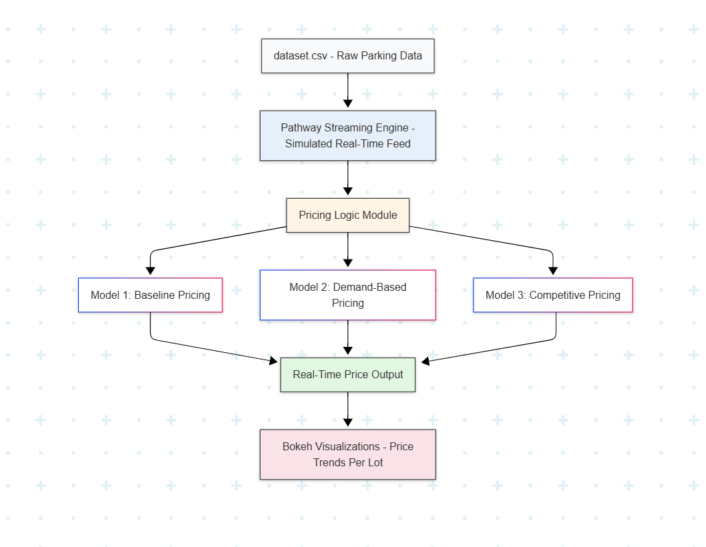

# Dynamic Pricing for Urban Parking Lots

This project was developed as part of **Summer Analytics 2025**, hosted by the **Consulting & Analytics Club, IIT Guwahati**, in collaboration with **Pathway**.

## Overview

Urban parking spaces often suffer from inefficiencies due to fixed pricing models. This project introduces a dynamic pricing engine that adjusts parking prices in real time based on several real-world factors including occupancy, traffic congestion, queue length, and more.

The system processes live parking lot data and uses predictive logic to optimize utilization and revenue. It simulates real-time behavior using **Pathway** and visualizes the evolving prices with **Bokeh**.

## Tech Stack

- **Python** – Programming language for logic and modeling
- **NumPy & Pandas** – Data processing and manipulation
- **Pathway** – Real-time data stream simulation
- **Bokeh** – Real-time interactive visualization
- **Mermaid** – System architecture diagram

## Models Implemented

1. **Model 1: Baseline Linear Model**  
   - Simple linear increase in price based on occupancy levels.

2. **Model 2: Demand-Based Pricing**  
   - Incorporates queue length, traffic congestion, special events, and vehicle type to estimate demand.

3. **Model 3 (Optional): Competitive Pricing**  
   - Adds competitor analysis using geographic proximity and nearby pricing trends.

## Architecture

Below is the high-level system architecture diagram.

A detailed explanation is available in [`architecture.md`](architecture.md).

